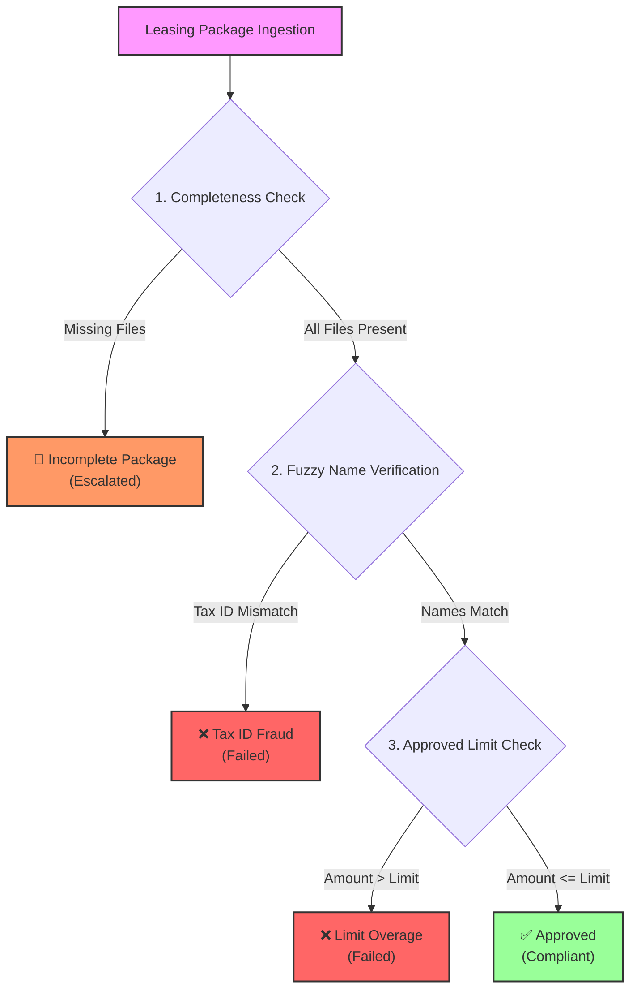

# Equipment Finance Compliance Agent

[Experience Demo](https://drive.google.com/file/d/1-vStAalZU9K8CsAHH_N1grq0kpRTseYC)

## Onboarding, Deployment & E2E Verification Guide (Version 6.0)

This comprehensive runbook details the step-by-step process for setting up the **Equipment Finance Compliance Agent (v6)** workspace, deploying the service to Google Cloud Run, discovering its A2A agent capabilities, and verifying compliance logic.

To ensure a consistent deployment baseline, the verified workstation codebase is stored as a master archive on Google Drive. Follow these commands to restore a clean workspace from this archive:

Download: [Drive](https://drive.google.com/file/d/1HymjyILyqdbibOJgq68wiQO8BXdGdPZV/view?usp=sharing)

```shell
# 1. Unzip the package in your workspace
unzip loan_processor_agent_sample.zip

# 2. Make sure the deployment script is executable
chmod +x deploy.sh

# 3. Execute the deployment script
# Usage: ./deploy.sh <PROJECT_ID> <SERVICE_NAME> [MODEL_NAME]
./deploy.sh your-projectname equipment-finance-compliance-agent gemini-3.5-flash
```

### 2. System Architecture & Verification Gates

The Compliance Agent acts as an automated back-office review workstation. It processes leasing package ingestion requests, downloads credit documents from FileNet, parses unstructured PDF layouts, and runs compliance verification gates before rendering outcomes via interactive Agent UI (A2UI) cards.

The agent operates three sequential validation gates:

1. **Completeness Check**: Verifies that the Credit Application, Invoice, and W-9 Form are present. If any document is missing, the package is escalated as **🚨 Incomplete Package (Escalated)**.  
2. **Fuzzy Name Verification Gate**: Evaluates alignment between the applicant's name extracted from the documents/W-9 against the Siebel SOR corporate profile. Mismatches are failed as **❌ Tax ID Fraud Mismatch (Failed)**.  
3. **Approved Limit Check**: Compares the total extracted invoice amount against the client's approved limit. Overages are failed as **❌ Limit Overage Exceeded (Failed)**.




### 3. Environment Parameters & Configuration

| Variable Name | Type | Default / Sandbox Value | Purpose |
| :---- | :---- | :---- | :---- |
| `PROJECT_ID` | Argument | *Your GCP Project ID* | Target Google Cloud project identifier. |
| `SERVICE_NAME` | Argument | `equipment-finance-compliance-agent-v6` | Desired Cloud Run service name. |
| `MODEL` | Env Var | `gemini-3.5-flash` | Backend Gemini model configuration. |
| `SIEBEL_URL` | Env Var | `https://[your-project]-fsi-mocks.us-central1.run.app` | Siebel system of record endpoint. |
| `FILENET_URL` | Env Var | `https://[your-project]-fsi-mocks.us-central1.run.app` | FileNet document repository. |

> [!IMPORTANT]
> **Memory Allocation Constraint (2Gi)**
> The Cloud Run container **MUST** be provisioned with a minimum of **2Gi** memory allocation (`--memory 2Gi`). This is crucial to prevent container Out-of-Memory (OOM) crashes during heavy PDF processing and OCR rasterization phases (e.g., W-9 form parsing).

### 4. Deploying to Google Cloud Run

To deploy the restored workspace files to Cloud Run, execute the automated deployment script:

```shell
./deploy.sh \
  "<PROJECT_ID>" \
  "<SERVICE_NAME>" \
  "gemini-3.5-flash"
```

*The script automatically packages the production files, provisions the container, sets optimized environment settings, and prints the active `<SERVICE_URL>` on success.*

### 5. Fetching the Agent Card (A2A Discovery)

Once deployed, you can retrieve the agent's official A2A card to discover its capabilities, metadata, and registered skills. Execute the following authenticated `curl` request:

```shell
curl -s -H "Authorization: Bearer \$(gcloud auth print-identity-token)" \
  "<SERVICE_URL>/.well-known/agent-card.json" | jq
```

*This GET endpoint is built natively into the core routing structure and serves the full AgentCard configuration as JSON.*

### 6. End-to-End Verification & Testing

Once the service is online, you can run the automated testing suite to assert that all compliance logic operates correctly.

#### Running the Verification Suite

```shell
python3 eval_runner.py
```

#### Verification Scenarios Matrix

The evaluation runner asserts the following expected outcomes across 6 mock package profiles:

| Package ID | Client Company | Category | Expected Outcome | Reason / Outcome Details |
| :---- | :---- | :---- | :---- | :---- |
| **PKG-10163** | Nova Tech Labs | Incomplete Package | **🚨 INCOMPLETE** | Failed completeness check; missing critical Credit Application document. |
| **PKG-10170** | Pioneer Excavation | Incomplete Package | **🚨 INCOMPLETE** | Failed completeness check; missing credit application document. |
| **PKG-10173** | Nova Tech Labs | Limit Overage | **❌ FAILED** | Amount exceeds client approved credit limit ($250,000). |
| **PKG-10180** | Vanguard Metalworks | Limit Overage | **❌ FAILED** | Invoice amount ($350,000) exceeds client limit ($150,000). |
| **PKG-10175** | Valley Agribusiness Inc. | Tax ID Mismatch | **❌ FAILED** | Tax ID fraud check failed; W-9 matching tax ID belongs to Pioneer Excavation. |
| **PKG-10181** | Apex Logistics Group | Tax ID Mismatch | **❌ FAILED** | Tax ID mismatch; Siebel SOR record belongs to Vanguard Metalworks. |
